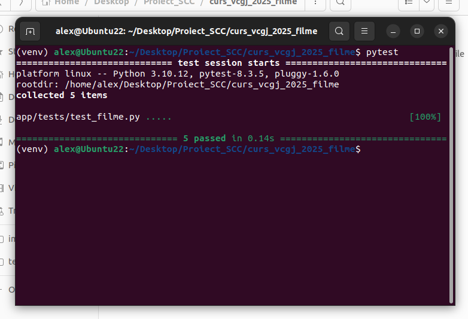
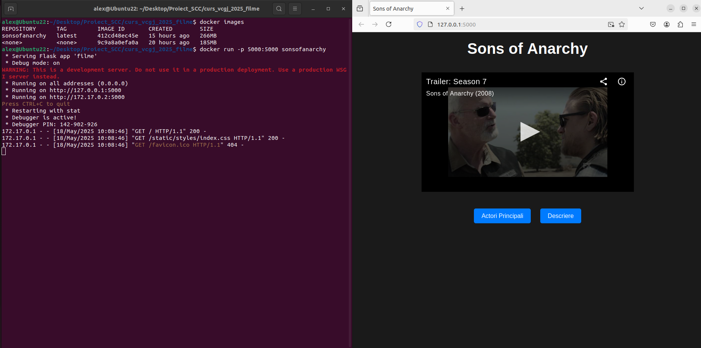
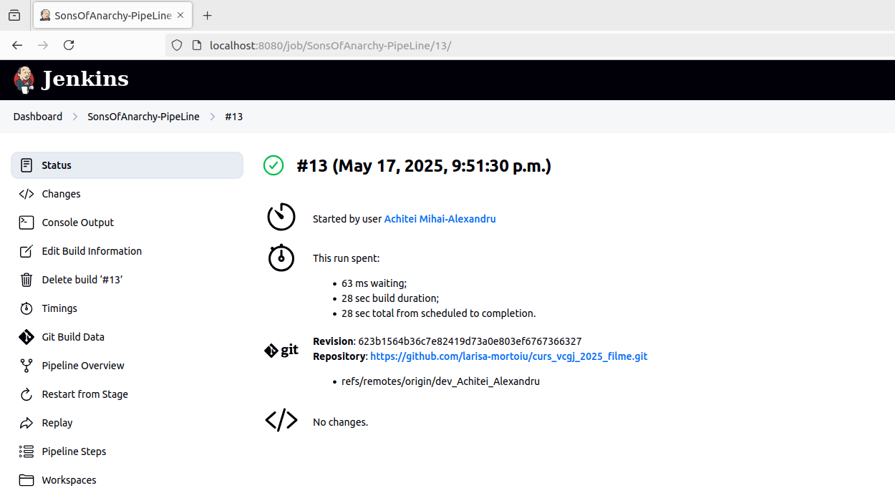

Proiect SCC - Containerizare și CI/CD

Autor: Achitei Mihai-Alexandru

Branch: dev_Achitei_Alexandru

Repo: https://github.com/larisa-mortoiu/curs_vcgj_2025_filme.git

✅ Ce am implementat

	Am dezvoltat o aplicație web în Flask, dedicată gestionării filmelor (proiectul Projet_SCC), care conține:
	* o pagină principală cu titlul aplicației și informații de bază;
	* o pagină cu detalii despre filme (implementare bazată pe filme.py);
	* o pagină cu descrierea proiectului, stilizată tematic;
	* stil personalizat CSS cu temă adaptată și butoane interactive;
	* structură modulară templates/, static/, și filme.py.

	Aplicația a fost containerizată cu Docker și testată automat prin Jenkins.

🔍 Cum am testat

	Am folosit:

	* rulare locală cu python3 filme.py
	* build și rulare în container Docker (docker build, docker run)
	* integrare continuă cu Jenkins (pull din GitHub, build, run)
	* comanda docker ps pentru a verifica starea containerului
	* accesarea aplicației în browser la http://localhost:5000
	
	Pytest:
	()

🐳 Cum am rulat în container (Docker)

	Comenzi folosite:

	* docker build -t sonsofanarchy .
	* run -p 5000:5000 sonsofanarchy

	Aplicația devine accesibilă în browser la:
	http://localhost:5000
	
	()

🔧 Jenkins: configurare și rulare automată

	Job creat în Jenkins: SonsOfAnarchy-PipeLine

	Configurat ca Pipeline script from SCM

	Repo: https://github.com/larisa-mortoiu/curs_vcgj_2025_filme.git
	Branch: dev_Achitei_Alexandru
	Script path: Jenkinsfile

	()

