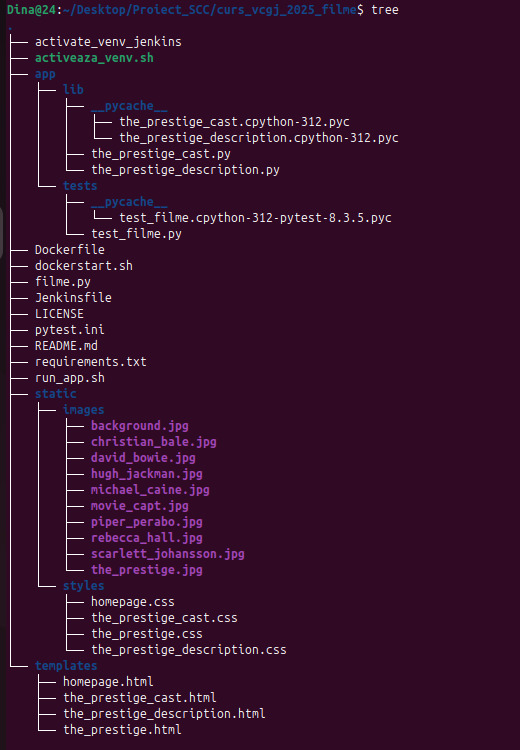
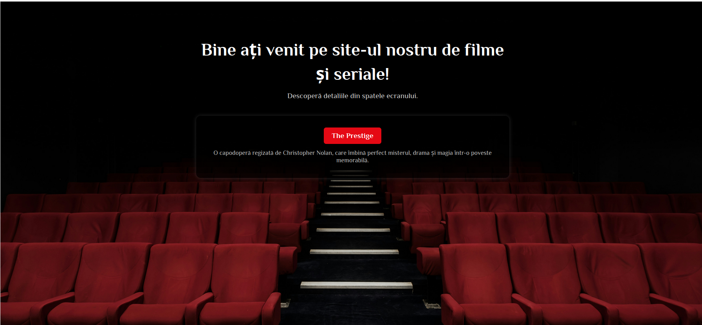
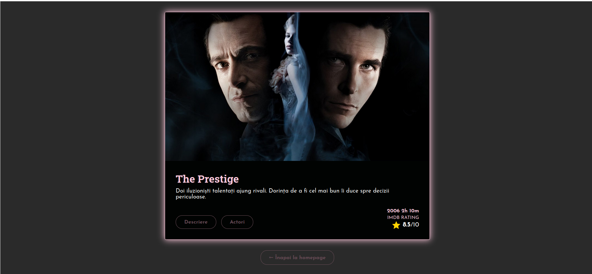
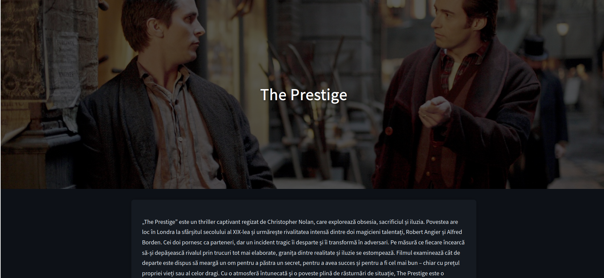
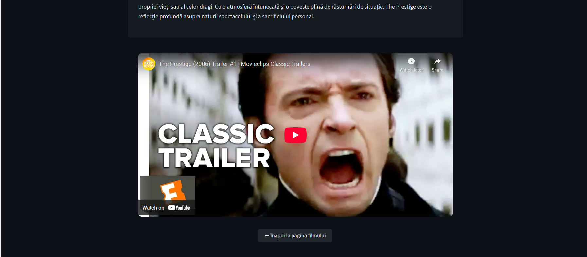
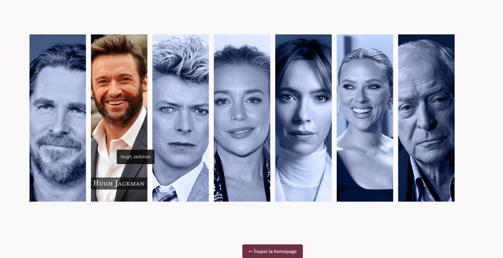

# Dina-Nitoi Maria-Alexandra

# CUPRINS
1. [Prezentarea generala a aplicatiei](#prezentarea-generala-a-aplicatiei)  
2. [Versiuni si functionalitati disponibile](#versiuni-si-functionalitati-disponibile)  
3. [Tehnologii utilizate](#tehnologii-utilizate)  
4. [Structura proiectului](#structura-proiectului)  
5. [Instructiuni de instalare si configurare](#instructiuni-de-instalare-si-configurare)  
6. [Interfata web prezentare](#interfata-web-prezentare)  
7. [Testare Pytest](#testare-pytest)  
8. [Analiza statica a codului cu Pylint](#analiza-statica-a-codului-cu-pylint)  
9. [Containerizare cu Docker](#containerizare-cu-docker)  
10. [Pipeline cicd cu Jenkins](#pipeline-cicd-cu-jenkins)  
11. [Procedura Pull Request](#procedura-pull-request)  
12. [Bibliografie](#bibliografie)

# Prezentarea generala a aplicatiei

Acest proiect web, intitulat **Filme**, are ca scop prezentarea detaliată a unui film ales – The Prestige.
Aplicația le oferă utilizatorilor acces rapid la informații esențiale despre film, precum descrierea tematică și distribuția principală, printr-o interfață intuitivă și responsivă. Din punct de vedere tehnic, aplicația este dezvoltată cu **Flask** și este rulată într-un mediu izolat folosind **Docker**, ceea ce asigură portabilitate și consistență între medii. Testele unitare sunt automatizate cu **Pytest**, iar verificarea calității codului este realizată prin **Pylint**. Întregul flux de dezvoltare – de la instalarea dependințelor, până la rularea testelor și containerizarea aplicației – este gestionat automat printr-un pipeline de integrare continuă configurat în **Jenkins**.


# Versiuni si functionalitati disponibile

v1.0 – Versiunea inițială stabilă

Afișarea informațiilor despre filmul The Prestige, selectat manual ca subiect principal al aplicației.

Pagini dedicate pentru:

 - Descrierea filmului – un rezumat detaliat care evidențiază tematica și atmosfera poveștii.

 - Distribuție – listă cu actorii principali, ilustrată vizual cu imagini și nume.

Navigare intuitivă între homepage și paginile detaliate, cu opțiuni de întoarcere.

Testare automată a funcționalităților prin Pytest.

Verificare statică a calității codului folosind Pylint.

Containerizare completă cu Docker, pentru rulare uniformă în medii diferite.

Integrare continuă cu Jenkins, care rulează automat:

- instalarea dependențelor

- testele unitare

- analiza codului

- build-ul imaginii Docker

# Tehnologii utilizate

- Python 3.11 – limbajul de programare utilizat pentru dezvoltarea aplicației.

- Flask – framework web ușor și flexibil, folosit pentru gestionarea rutelor și a logicii aplicației.

- HTML & CSS – pentru structura și stilizarea interfeței web.

- Pytest – pentru scrierea și rularea testelor unitare.

- Pylint – pentru analiza statică a codului și menținerea unui stil coerent.

- Docker – pentru containerizarea aplicației, oferind un mediu izolat și portabil.

- Jenkins – pentru integrare continuă: automatizează pașii de build, testare și analiză a codului.

# Structura proiectului



- app/
  
  Conține logica principală a aplicației.
   - lib/ – module Python care oferă datele pentru descriere și distribuție:
   the_prestige_cast.py – returnează lista actorilor.
   the_prestige_description.py – returnează descrierea filmului.
   
   - tests/ – teste unitare scrise cu Pytest:
   test_filme.py – verifică funcțiile din lib/.

- static/  
  
  Conține resurse statice accesate de aplicație.
  - images/ – imaginile folosite pentru actori și background.
  - styles/ – fișiere CSS pentru stilizarea paginilor HTML.


- templates/
  
   Fișiere HTML care definesc structura vizuală a paginilor web.
  - homepage.html – pagina de pornire.
  - the_prestige_cast.html – pagină cu distribuția.
  - the_prestige_description.html – pagină cu descrierea filmului.
  - the_prestige.html – pagină principală pentru film.

- Aplicația Flask principală
  - filme.py – aplicația Flask principală, definește rutele.  


- Fișiere de configurare și automatizare
  - Jenkinsfile – definește pașii de build/test/deploy în Jenkins.  
  - Dockerfile – folosit pentru a construi imaginea Docker.
  
- Scripturi de rulare și mediu
  - pytest.ini – configurare pentru rularea testelor.  
  - requirements.txt – lista librăriilor necesare.  
  - dockerstart.sh – script de pornire în container.  
  - run_app.sh – script de rulare locală.  
  - activate_venv.sh / activate_venv_jenkins – scripturi pentru activarea mediului virtual.  

  # Instructiuni de instalare si configurare

  ## Configurație inițială
 Navighează în directorul Desktop al utilizatorului curent, locul unde va fi clonat proiectul.
```
cd ~/Desktop/            
```

Clonează repository-ul GitHub local
```
git clone https://github.com/larisa-mortoiu/curs_vcgj_2025_filme.git
```

Intră în directorul nou creat care conține fișierele proiectului clonat.
```
cd curs_vcgj_2025_filme
```

Aceasta afișează toate branch-urile remote disponibile în repository-ul GitHub.
```
git branches -r     
```

Creează local un branch nou denumit dev_Dina_Alexandra pe baza branch-ului cu același nume de pe remote și comută pe el.
```
git checkout -b dev_Dina_Alexandra origin/dev_Dina_Alexandra
```
Rulează scriptul de activare a mediului virtual, sau îl creează dacă nu există.
```
. ./activeaza_venv.sh     
```
Pornește aplicația Flask, setând IP-ul și portul pentru accesarea în browser.
```
. ./ruleaza_app.sh    
```
 ## Configurare .venv și instalare pachete
 Pentru a rula aplicația local, este necesară activarea unui mediu virtual Python. Acest proces este automatizat prin scripturi bash aflate în rădăcina proiectului:

- activeaza_venv.sh
 Acest script încearcă să activeze un mediu virtual existent în directorul .venv.
 Dacă .venv nu există sau activarea eșuează, scriptul creează automat un nou mediu virtual și instalează toate pachetele din requirements.txt.

-start_app.sh
 Se folosește doar după activarea mediului virtual. Scriptul lansează aplicația Flask pe IP-ul 127.0.0.1, portul 5011. Poți accesa aplicația din browser la:
 http://127.0.0.1:5011 sau http://localhost:5011

 

 # Interfata web prezentare

 ## Pagina principală (Homepage)
  Este punctul de start al aplicației, oferind utilizatorului o primă interacțiune și acces rapid către detalii despre filmul selectat.
  
  

 ## Pagina film
 
 Oferă o prezentare sumară a filmului, cu opțiuni de navigare către pagina de descriere detaliată sau distribuție, permițând utilizatorului să aleagă ce informație dorește să exploreze mai departe.

  

  ## Secțiunea de descriere 
  Oferă o prezentare amplă a subiectului filmului, evidențiind temele și atmosfera acestuia.
  
  
  

  ## Secțiunea de distribuție
  Afișează actorii principali împreună cu personajele pe care le interpretează.
   
 
