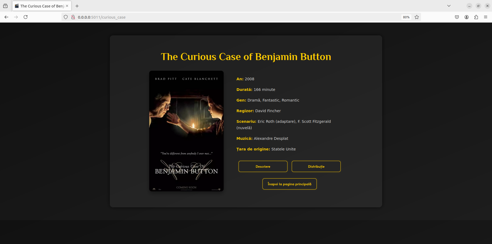
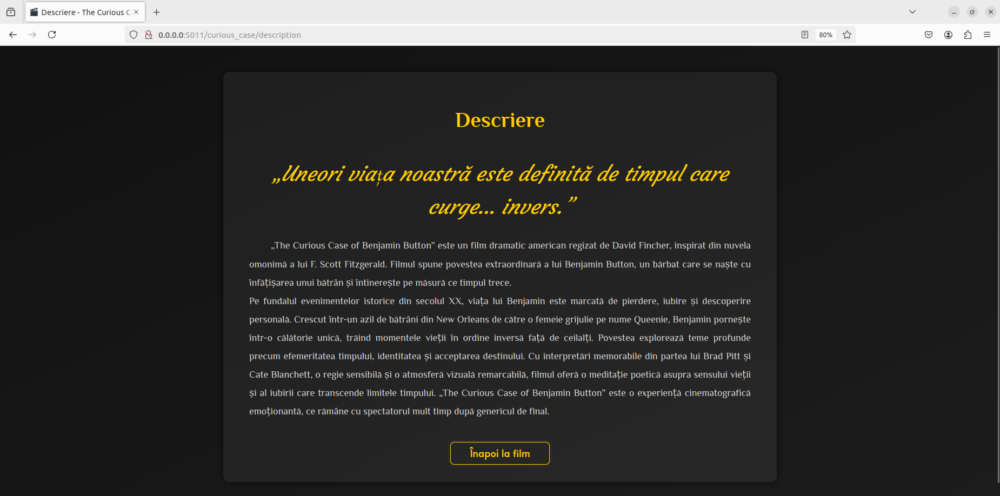
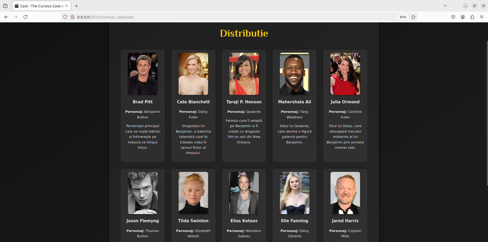
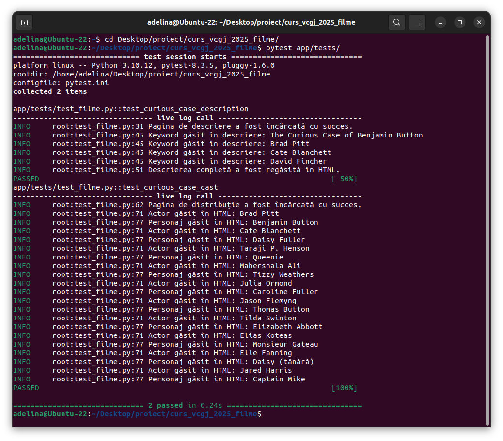

# Constantinescu Adelina

Această aplicație web este o implementare personalizată dedicată filmului _The Curious Case of Benjamin Button_. Proiectul oferă o interfață web modernă prin care utilizatorii pot vizualiza informații despre distribuția filmului și descrierea tematicii, fiind construit cu Python și Flask, cu suport pentru testare automată și analiză statică a codului.

---

## 📑 Cuprins

- [Funcționalități](#funcționalități)
- [Tehnologii utilizate](#tehnologii-utilizate)
- [Structura proiectului](#structura-proiectului)
- [Configurare și rulare](#configurare-și-rulare)
- [Interfață web](#interfață-web)
- [Testare și analiză cod](#testare-și-analiză-cod)
- [Rulare cu Docker](#rulare-cu-docker)
- [Etape pipeline Jenkins](#etape-pipeline-jenkins)
- [Pull Request](#pull-request)


---
## Funcționalități

- Pagina principală de tip homepage cu titlu, imagine și mesaj introductiv
- Afișarea descrierii filmului _The Curious Case of Benjamin Button_ într-o pagină dedicată
- Afișarea distribuției (actori și personaje) cu poze și descrieri individuale
- Navigare ușoară între pagini (linkuri + butoane vizuale)
- Design modern cu CSS personalizat și fonturi Google Fonts

---

## Tehnologii utilizate

- Python 3.10
- Flask (pentru server web)
- HTML5 & CSS3 (interfață)
- Pytest (testare automată)
- Pylint (analiză cod)
- Jenkins (CI/CD pipeline)
- Docker (pentru rulare izolată)


---

## Structura proiectului

```text
CURS_VCGJ_2025_FILME/
├── app/
│   ├── lib/
│   │   ├── curious_case_cast.py
│   │   └── curious_case_description.py
│   └── tests/
│       └── test_filme.py
├── static/
│   ├── images/
│   └── styles/
│       ├── attributes.css
│       ├── curious_case.css
│       └── homepage.css
├── templates/
│   ├── curious_case_cast.html
│   ├── curious_case_description.html
│   ├── curious_case.html
│   └── homepage.html
├── .gitignore
├── activeaza_venv
├── activeaza_venv_Jenkins
├── Dockerfile
├── dockerstart.sh
├── filme.py
├── Jenkinsfile
├── LICENSE
├── pytest.ini
├── README.md
├── requirements.txt
└── start_app.sh
```

---

## Configurare și rulare
### Configurare initiala

1. Clonează proiectul local:

```bash
cd Desktop/proiect/
git clone https://github.com/larisa-mortoiu/curs_vcgj_2025_filme.git
```

2. Instalare pachete de baza
```bash
sudo apt update && sudo apt upgrade
sudo apt install git
sudo apt install python3
sudo apt install python3-pip
sudo apt install python3.10-venv  # sau python3.12-venv, în funcție de versiune
sudo apt install net-tools
```
3. Trecere in folderul cu proiectul
```bash
 cd curs_vcgj_2025_filme
 ```
4. Comuta pe branch-ul personal
```bash
git checkout dev_Constantinescu_Adelina
```
### Configurare .venv
Proiectul include două scripturi bash utile pentru rulare rapidă și automată în orice mediu:


#### 🔹 `activeaza_venv`

Acest script verifică dacă există un mediu virtual activabil în directorul `.venv`.

- Dacă mediul virtual există și poate fi activat → îl pornește imediat
- Dacă nu există sau activarea eșuează → scriptul rulează automat `activeaza_venv_Jenkins`, care:
  - Creează un nou mediu virtual
  - Instalează automat toate pachetele necesare din `requirements.txt`

Această abordare ajută la rularea proiectului atât în medii locale, cât și în Jenkins.


#### 🔹 `start_app.sh`

După activarea mediului virtual, rulează acest script pentru a porni aplicația Flask.

- Serverul pornește pe adresa `127.0.0.1`, portul `5011`
- Aplicația poate fi accesată din browser la:
  - [http://127.0.0.1:5011](http://127.0.0.1:5011)
  - sau
  - [http://localhost:5011](http://localhost:5011)

---
## Interfață web

###  Pagini disponibile

- **Homepage** (`/`)
  - Pagina principală cu titlul proiectului, un mesaj de întâmpinare și posterul filmului
  - Buton de acces către pagina dedicată filmului
  - 
- **Pagina filmului** (`/curious_case`)
  - Oferă două butoane pentru navigare:
    - 🔸 **Descriere** (`/curious_case/description`)
    - 🔸 **Distribuție** (`/curious_case/cast`)
    - 
- **Descriere** (`/curious_case/description`)
  - Afișează un text narativ formatat despre film, regizor, tematică și mesajul său
  - 
- **Distribuție** (`/curious_case/cast`)
  - Listează actorii principali, numele personajelor și o scurtă descriere
  - Include imagini reprezentative pentru fiecare actor
  - 

---

## Testare și analiză cod

Testarea aplicației se realizează folosind **Pytest**, prin teste unitare definite în fișierul `test_filme.py`, localizat în directorul `app/tests/`.


### Ce validează testele

Testele acoperă funcționalitatea principală a aplicației Flask:

- **Testarea descrierii filmului**  
  Se testează funcția `get_description()` din modulul `curious_case_description`.  
  Verificările includ:
  - Răspunsul HTTP al rutei `/curious_case/description` este 200 (OK)
  - Textul HTML generat conține cuvinte-cheie esențiale precum `Brad Pitt`, `Cate Blanchett`, `David Fincher`
  - Descrierea returnată de funcție este identică cu cea afișată în pagină

- **Testarea distribuției**  
  Se evaluează funcția `get_cast()` din `curious_case_cast`, accesată prin ruta `/curious_case/cast`.  
  Verificările includ:
  - Statusul răspunsului este valid
  - Fiecare actor și numele personajului sunt afișate corect în HTML
  - Se validează existența câmpurilor `name` și `character` pentru fiecare membru din distribuție


### Obiectivul testelor

Scopul testelor este să confirme:
- că datele generate de backend sunt afișate corect în interfața HTML
- că toate elementele esențiale ale aplicației apar în pagini
- că modificările în cod nu afectează funcționalitatea de bază


### Rulare locală

Testele pot fi rulate local folosind comanda:

```bash
pytest app/tests/
```
 - 

 ### Analiză statică a codului

Pentru asigurarea unui cod curat și ușor de întreținut, aplicația utilizează **Pylint**, un instrument de analiză statică Python.

Verificările acoperă:
- Respectarea convențiilor de stil (naming, indentare, lungime linii)
- Utilizarea corectă a variabilelor (nefolosite, redefinite)
- Organizarea logică a modulelor

Analiza este aplicată pe:
- modulele din `app/lib/`
- fișierul principal `filme.py`
- fișierele de test

---

### Integrare în Jenkins

Analiza Pylint este integrată într-o etapă dedicată a pipeline-ului Jenkins. Comenzile utilizate:

```bash
pylint --exit-zero app/lib/*.py
pylint --exit-zero app/tests/*.py
pylint --exit-zero filme.py
```
---

## Rulare cu Docker

Aplicația poate fi rulată rapid și izolat folosind Docker. Acest lucru este util pentru testare, livrare sau rulare pe orice sistem fără a instala dependințele manual.


Asigură-te că te afli în directorul proiectului unde se află `Dockerfile`, apoi rulează:

```bash
docker build -t adelina_docker:latest .
sudo docker run --name adelina_docker -p 8020:5011 adelina_docker:latest
```

Pentru a rula aplicatia prin container vom folosi urmatoarea comanda:

    sudo docker start adelina_docker
Pentru a opri rularea aplicatiei:

    sudo docker stop adelina_docker

---

## Etape pipeline Jenkins

Pentru integrarea continuă, aplicația utilizează **Jenkins**, care rulează automat o serie de pași la fiecare actualizare a codului.

Etapele definite în `Jenkinsfile` sunt:

- **Clone repo**: preia automat codul din branch-ul `main_Constantinescu_Adelina`
- **Build**: creează și activează un mediu virtual Python, instalează dependințele
- **Code quality**: rulează `pylint` cu `--exit-zero` pentru a verifica stilul fără a bloca execuția
- **Run Tests**: rulează testele unitare definite cu `pytest`
- **Containerizare Docker**: creează și rulează o imagine Docker a aplicației pe portul `8020`


```bash
    systemctl start jenkins
```


---

## Pull Request
Dupa finalizarea cerintelor, am realizat un pull request de pe `dev_Constantinescu_Adelina` catre `main_Constantinescu_Adelina`.

