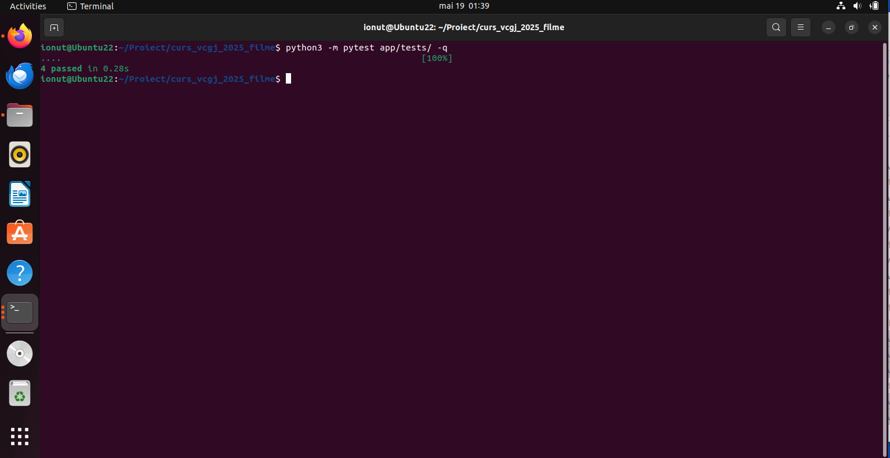
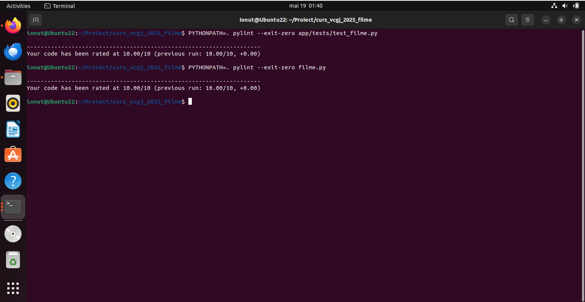
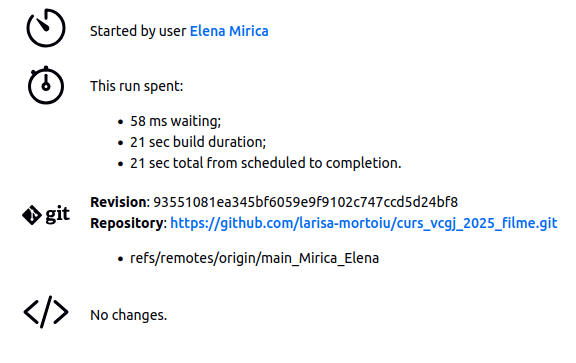

# Mirica Elena
Această aplicație web a fost creată în cadrul cursului SCC și permite gestionarea unei colecții de filme/seriale, oferind funcționalități de bază. 
Se urmărește punerea în practică a noțiunilor esențiale învățate în cadrul disciplinei, de dezvoltare web, testare automată și integrare continuă.

Operațiile aplicației sunt gestionate prin rute bine definite în Flask. Docker a fost folosit pentru a crea un mediu de rulare consistent  indiferent de sistemul folosit. Jenkins a avut rolul de a automatiza testarea și integrarea continuă.

Pentru exemplificare, a fost prezentat serialul Bridgerton, realizat de Netflix.

## Cuprins

- [Tehnologii utilizate](#tehnologii-utilizate)
- [Setup](#setup)
- [Aducerea proiectului pe local](#aducerea-proiectului-pe-local)
- [Alte pachete folosite](#alte-pachete-folosite)
- [Fișiere din proiect](#fișiere-din-proiect)
- [Interfața web](#interfața-web)
- [Testare pytest](#testare-pytest)
- [Testare pylint](#testare-pylint)
- [Docker](#docker)
- [Jenkins](#jenkins)
- [Pull request](#pull-request)

## Tehnologii utilizate

- HTML/CSS
- Flask
- Python 3.10+
- Pytest
- Pylint
- Docker
- Jenkins

## Setup

A fost creat un director pe mașina virtuală  locală (Ubuntu 22.04) pentru dezvoltarea proiectului. Fișierele au fost editate în Visual Studio Code, descărcat de pe pagina lor oficială (https://code.visualstudio.com/?wt.mc_id=vscom_downloads).


## Aducerea proiectului pe local

Pentru a lucra local la proiect, este necesară clonarea acestuia de pe serverul GitHub și accesarea ramurii de dezvoltare relevante. Comenzile de mai jos realizează descărcarea codului și comutarea pe ramura dev_Mirica_Elena, unde se află implementarea in progress. 

Numai după testarea aplicației se pot adăuga modificările în main_Mirica_Elena.

 ```bash
git clone https://github.com/larisa-mortoiu/curs_vcgj_2025_filme.git
cd curs_vcgj_2025_filme
git checkout dev_Mirica_Elena
```

## Alte pachete folosite
 ```bash
sudo apt install git
sudo apt install python3
sudo apt install python3-pip
sudo apt install python3.12-venv
```

## Fișiere din proiect

- **`filme.py`** – Punctul de pornire al aplicației. Inițializează și rulează serverul Flask.
- **`requirements.txt`** – Lista cu toate bibliotecile necesare pentru rularea aplicației.
- **`Dockerfile`** – Conține instrucțiuni pentru construirea imaginii Docker.
- **`Jenkinsfile`** – Configurație pentru rularea automată a testelor și build-ului în Jenkins.
- **`pytest.ini`** – Setări pentru rularea testelor cu `pytest`.
- **`dockerstart.sh`** – Script pentru rularea aplicației în Docker.
- **`activeaza_venv`** – Activează mediul virtual pe Linux. Verifică întâi dacă există un mediu virtual activabil în directorul .venv. Dacă nu există, se creează și se instalează pachetele din requirements.txt. Altfell se activează mediul.
- **`start_app.sh`** – Script pentru pornirea aplicației în mediu local (după activeaza_venv). Serverul pornește la adresa 127.0.0.1, portul 5011. Poate fi accesată din browser.
- **`activeaza_venv_jenkins`** – Activează mediul virtual într-un mediu de CI precum Jenkins.
- **`test_filme.py`** – Testează funcționalitățile specifice din `filme.py`, cum ar fi validarea și manipularea datelor filmelor. Are definite mai multe funcții în interior.
- **`homepage.html`** – Pagina principală generală sau de introducere a aplicației (landing page).
- **`bridgerton.html`** – Pagină care poate combina informațiile despre serial într-o prezentare unificată.
- **`bridgerton_cast.html`** – Afișează distribuția serialului "Bridgerton".
- **`bridgerton_description.html`** – Pagina cu descrierea și contextul serialului "Bridgerton".
- **`bridgerton_cast.py`** – Script Python care gestionează date legate de actori/distribuția serialului "Bridgerton".
- **`bridgerton_description.py`** – Script care conține descrierea sau metadatele serialului.
- **`README.md`** – Acest fișier, conținând descrierea proiectului și modul de realizare.


## Interfața web
Homepage


Pagina principală Bridgerton


Descrierea Bridgerton


Cast Bridgerton


## Testare pytest

Aceste teste au rolul de a garanta stabilitatea logicii aplicației și de a semnala din timp orice eroare apărută în manipularea datelor filmelor. 

- **Structura descrierii (`bridgerton_description`)**
  - Verifică dacă textul returnat este împărțit în paragrafe corecte.
  - Asigură că fiecare paragraf are o lungime minimă pentru a evita conținutul gol sau superficial.
  - Confirmă că tagurile HTML `<p>` și `</p>` sunt corect închise.

- **Distribuția actorilor (`bridgerton_cast`)**
  - Se verifică extensia imaginilor actorilor (doar `.jpg`, `.jpeg` și `.png` sunt permise).
  - Numele fișierelor de imagine trebuie să fie lowercase, fără spații.
  - Se detectează și raportează eventualele duplicate în lista de actori.

Ele pot fi rulate folosind comanda:

```bash
pytest 
```



Testele au trecut cu succes.


## Testare pylint

Pylint este utilizat pentru a analiza calitatea codului din proiect. Acesta verifică respectarea convențiilor de numire și stil, complexitatea funcțiilor și claselor, prezența comentariilor și docstring-urilor, codul neutilizat (variabile, importuri) și posibile erori de logică, cum ar fi apeluri incorecte sau atribute lipsă.

Pentru a analiza codul, folosește comanda:

```bash
pylint [nume_fisier]
```

Următoarea imagine este un test pentru filme.py.



Se poate afirma că acest cod poate fi îmbunătățit.

## Docker

In Dockerfile se definesc:

- Se creează un utilizator (`elena_docker`).
- Se setează directorul de lucru la `/home/elena_docker`.
- Se copiază în container fișierele aplicației: codul sursă, șabloanele HTML, fișierele statice și scripturile.
- Se creează un mediu virtual Python în container (`.venv`) și se instalează automat dependențele din `requirements.txt`.
- Se folosește portul `5011` (portul pe care aplicația rulează în container).
- Aplicația este pornită folosind scriptul `dockerstart.sh`.

Script-ul dockerstart.sh activează mediul virtual și pornește aplicația Flask. De asemenea, setează variabila de mediu `FLASK_APP` necesară pentru inițializarea corectă a aplicației.

Comenzi utilizate:
```bash
docker build -t elena_docker:latest .
sudo docker run --name elena_docker -p 8020:5011 elena_docker:latest
sudo docker start elena_docker
sudo docker stop elena_docker
```

Output rulare dockertsart.sh:


La accesarea link-ului se va ajunge la aceeași pagină web, dar containerizată.

## Jenkins

Pipeline-ul definit rulează în orice agent disponibil (`agent any`) și conține următoarele etape principale:
- Se clonează automat codul sursă din branch-ul `main_Mirica_Elena` al repository-ului
- Se actualizează pip și se instalează toate pachetele necesare definite în requirements.txt, precum și instrumentele de testare pytest și pylint
- Se rulează automat testele din fișierele aflate în app/tests/, iar dacă unele teste eșuează, pipeline-ul continuă. Tot aici se rulează analiza statică pylint pe codul sursă și pe testele scrise


După rularea tuturor etapelor, Jenkins va afișa mesajul final Pipeline finished, indiferent de rezultatul testelor sau al analizei pylint.



Vizualizarea pipe-line-ului se face în Blue Ocean:


## Pull request

Am solocitat aprobarea unui coleg pentru a adăuga modificări în main_Mirica_Elena:


