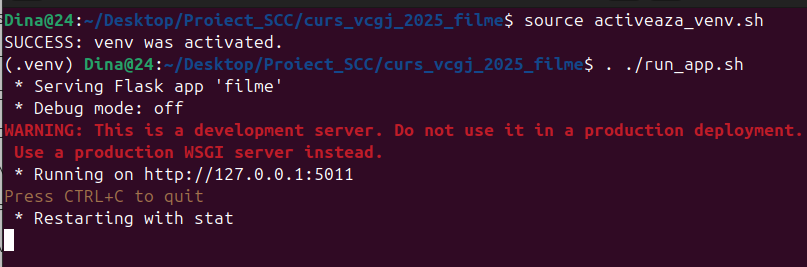

# Dina-Nitoi Maria-Alexandra

# CUPRINS
1. [Prezentarea generala a aplicatiei](#prezentarea-generala-a-aplicatiei)  
2. [Versiuni si functionalitati disponibile](#versiuni-si-functionalitati-disponibile)  
3. [Tehnologii utilizate](#tehnologii-utilizate)  
4. [Structura proiectului](#structura-proiectului)  
5. [Instructiuni de instalare si configurare](#instructiuni-de-instalare-si-configurare)  
6. [Interfata web prezentare](#interfata-web-prezentare)  
7. [Testare Pytest](#testare-pytest)  
8. [Analiza statica a codului cu Pylint](#analiza-statica-a-codului-cu-pylint)  
9. [Containerizare cu Docker](#containerizare-cu-docker)  
10. [Pipeline cicd cu Jenkins](#pipeline-cicd-cu-jenkins)  
11. [Procedura Pull Request](#procedura-pull-request)  
12. [Bibliografie](#bibliografie)

# Prezentarea generala a aplicatiei

Acest proiect web, intitulat **Filme**, are ca scop prezentarea detaliată a unui film ales – The Prestige.
Aplicația le oferă utilizatorilor acces rapid la informații esențiale despre film, precum descrierea tematică și distribuția principală, printr-o interfață intuitivă și responsivă. Din punct de vedere tehnic, aplicația este dezvoltată cu **Flask** și este rulată într-un mediu izolat folosind **Docker**, ceea ce asigură portabilitate și consistență între medii. Testele unitare sunt automatizate cu **Pytest**, iar verificarea calității codului este realizată prin **Pylint**. Întregul flux de dezvoltare – de la instalarea dependințelor, până la rularea testelor și containerizarea aplicației – este gestionat automat printr-un pipeline de integrare continuă configurat în **Jenkins**.


# Versiuni si functionalitati disponibile

v1.0 – Versiunea actuală

Afișarea informațiilor despre filmul The Prestige, selectat manual ca subiect principal al aplicației.

Pagini dedicate pentru:

 - Descrierea filmului – un rezumat detaliat care evidențiază tematica și atmosfera poveștii.

 - Distribuție – listă cu actorii principali, ilustrată vizual cu imagini și nume.

Navigare intuitivă între homepage și paginile detaliate, cu opțiuni de întoarcere.

Testare automată a funcționalităților prin Pytest.

Verificare statică a calității codului folosind Pylint.

Containerizare completă cu Docker, pentru rulare uniformă în medii diferite.

Integrare continuă cu Jenkins, care rulează automat:

- instalarea dependențelor

- testele unitare

- analiza codului

- build-ul imaginii Docker

# Tehnologii utilizate

- Python 3.11 – limbajul de programare utilizat pentru dezvoltarea aplicației.

- Flask – framework web ușor și flexibil, folosit pentru gestionarea rutelor și a logicii aplicației.

- HTML & CSS – pentru structura și stilizarea interfeței web.

- Pytest – pentru scrierea și rularea testelor unitare.

- Pylint – pentru analiza statică a codului și menținerea unui stil coerent.

- Docker – pentru containerizarea aplicației, oferind un mediu izolat și portabil.

- Jenkins – pentru integrare continuă: automatizează pașii de build, testare și analiză a codului.

# Structura proiectului


- app/
  
  Conține logica principală a aplicației.
   - lib/ – module Python care oferă datele pentru descriere și distribuție:
   the_prestige_cast.py – returnează lista actorilor.
   the_prestige_description.py – returnează descrierea filmului.
   
   - tests/ – teste unitare scrise cu Pytest:
   test_filme.py – verifică funcțiile din lib/.

- static/  
  
  Conține resurse statice accesate de aplicație.
  - images/ – imaginile folosite pentru actori și background.
  - styles/ – fișiere CSS pentru stilizarea paginilor HTML.


- templates/
  
   Fișiere HTML care definesc structura vizuală a paginilor web.
  - homepage.html – pagina de pornire.
  - the_prestige_cast.html – pagină cu distribuția.
  - the_prestige_description.html – pagină cu descrierea filmului.
  - the_prestige.html – pagină principală pentru film.

- Aplicația Flask principală
  - filme.py – aplicația Flask principală, definește rutele.  


- Fișiere de configurare și automatizare
  - Jenkinsfile – definește pașii de build/test/deploy în Jenkins.  
  - Dockerfile – folosit pentru a construi imaginea Docker.
  
- Scripturi de rulare și mediu
  - pytest.ini – configurare pentru rularea testelor.  
  - requirements.txt – lista librăriilor necesare.  
  - dockerstart.sh – script de pornire în container.  
  - run_app.sh – script de rulare locală.  
  - activate_venv.sh / activate_venv_jenkins – scripturi pentru activarea mediului virtual.  

  # Instructiuni de instalare si configurare

  ## Configurație inițială
 Navighează în directorul Desktop al utilizatorului curent, locul unde va fi clonat proiectul.
```
cd ~/Desktop/            
```

Clonează repository-ul GitHub local
```
git clone https://github.com/larisa-mortoiu/curs_vcgj_2025_filme.git
```

Intră în directorul nou creat care conține fișierele proiectului clonat.
```
cd curs_vcgj_2025_filme
```

Aceasta afișează toate branch-urile remote disponibile în repository-ul GitHub.
```
git branches -r     
```

Creează local un branch nou denumit dev_Dina_Alexandra pe baza branch-ului cu același nume de pe remote și comută pe el.
```
git checkout -b dev_Dina_Alexandra origin/dev_Dina_Alexandra
```
Rulează scriptul de activare a mediului virtual, sau îl creează dacă nu există.
```
. ./activeaza_venv.sh     
```
Pornește aplicația Flask, setând IP-ul și portul pentru accesarea în browser.
```
. ./ruleaza_app.sh    
```
 ## Configurare .venv și instalare pachete
 Pentru a rula aplicația local, este necesară activarea unui mediu virtual Python. Acest proces este automatizat prin scripturi bash aflate în rădăcina proiectului:

- activeaza_venv.sh
 Acest script încearcă să activeze un mediu virtual existent în directorul .venv.
 Dacă .venv nu există sau activarea eșuează, scriptul creează automat un nou mediu virtual și instalează toate pachetele din requirements.txt.

-start_app.sh
 Se folosește doar după activarea mediului virtual. Scriptul lansează aplicația Flask pe IP-ul 127.0.0.1, portul 5011. Poți accesa aplicația din browser la:
 http://127.0.0.1:5011 sau http://localhost:5011

 

 # Interfata web prezentare

 ## Pagina principală (Homepage)
  Este punctul de start al aplicației, oferind utilizatorului o primă interacțiune și acces rapid către detalii despre filmul selectat.
  
  

 ## Pagina film
 
 Oferă o prezentare sumară a filmului, cu opțiuni de navigare către pagina de descriere detaliată sau distribuție, permițând utilizatorului să aleagă ce informație dorește să exploreze mai departe.

  

  ## Secțiunea de descriere 
  Oferă o prezentare amplă a subiectului filmului, evidențiind temele și atmosfera acestuia.
  
  
  
  
  ## Secțiunea de distribuție
  Afișează actorii principali împreună cu personajele pe care le interpretează.
   
   
  # Testare Pytest

Pentru a valida funcționalitatea corectă a aplicației, au fost implementate teste unitare cu ajutorul framework-ului Pytest. Acestea sunt definite în fișierul test_filme.py, aflat în directorul app/tests/.

Testele vizează componentele esențiale ale aplicației:

Testarea descrierii filmului 
 - Verifică dacă descrierea filmului returnată de get_descriere()
 - Caută în textul descrierii anumite cuvinte-cheie relevante pentru tematica filmului The Prestige

Testarea distribuției
 - Evaluează formatul general al listei de actori returnată de get_actori()
 - Confirmă prezența actorilor principali în listă
   
Pentru fiecare test:

Se apelează funcțiile din the_prestige_description.py și the_prestige_cast.py.

Se verifică tipul valorii returnate.

Se confirmă prezența anumitor elemente esențiale în conținutul returnat (ex: lungimea textului descriptiv, existența unor actori cunoscuți).

Testele rulează atât local (manual, cu comanda pytest), cât și automat, prin intermediul pipeline-ului Jenkins configurat în proiect. Acest lucru contribuie la menținerea unei funcționări stabile și verificabile a aplicației la fiecare modificare.

## Testare locală

  

## Testare automată

Prin intermediul Jenkinsfile
```
stage('Run Tests - pytest') {
          steps {
              sh '''
                  . ${VENV_DIR}/bin/activate
                  pytest app/tests
              '''
   }
 }
 ```
# Analiza statica a codului cu Pylint
Pentru verificarea calității codului sursă, proiectul utilizează Pylint – un instrument de analiză statică ce ajută la menținerea unui stil de cod curat și coerent. Analiza este aplicată asupra fișierelor esențiale ale aplicației, precum modulele din app/lib/, fișierul principal filme.py și testele din app/tests/.

Această etapă detectează automat aspecte precum:

- probleme de formatare ;

- denumiri improprii pentru variabile sau funcții;

- cod inutil sau variabile nefolosite;

- abateri de la bunele practici Python.

Verificarea Pylint este integrată în procesul de integrare continuă (CI) printr-un stage dedicat în Jenkins, care rulează automat comenzile:

```
pylint --exit-zero app/lib/*.py
pylint --exit-zero app/tests/*.py
pylint --exit-zero filme.py
```

# Containerizare cu Docker

Containerizarea este o tehnică prin care aplicația și toate dependențele ei sunt împachetate într-un mediu izolat, numit container. Acesta rulează la fel indiferent de sistemul de operare sau configurația locală, ceea ce elimină problemele de compatibilitate („merge la mine, dar nu la tine”).

În acest proiect, containerizarea este realizată cu Docker și ne ajută să rulăm aplicația într-un mod predictibil, portabil și ușor de distribuit, fie local, fie într-un mediu de producție sau testare.

# Configurație. Dockerfile

Fișierul Dockerfile definește pașii pentru construirea imaginii:

- Pornește de la o imagine `python:3.11-alpine`.
- Creează un utilizator non-root `dina_docker`.
- Setează directorul de lucru și copiază codul aplicației.
- Oferă permisiuni de execuție scriptului `dockerstart.sh`.
- Creează un mediu virtual și instalează dependențele.
- Rulează aplicația Flask ca utilizator non-root pe portul 5011.

# Containter și imagine Docker

Creare imagine: 

``` docker build -t movieimage:v1 .```

 

Creare container:  

 ```docker create --name moviecontainer -p 8020:5011 movieimage:v1```

 
 
 Pornire container:
 
 ```docker start moviecontainer```
 
 

După pornirea aplicației cu `./dockerstart.sh`, aceasta va fi accesibilă în browser la adresa locală: **http://127.0.0.1:8020**.

# Pipeline CI/CD cu Jenkins

Jenkins este un instrument de automatizare folosit în acest proiect pentru a gestiona procesul de integrare continuă. El a fost configurat astfel încât să detecteze automat modificările din repository-ul GitHub și să execute un set de pași definiți în fișierul Jenkinsfile. Acești pași includ activarea mediului virtual, instalarea dependințelor, rularea testelor și verificarea calității codului. Prin această automatizare, Jenkins asigură că fiecare actualizare a aplicației este verificată și validată într-un mod consistent, fără intervenție manuală.

#Jenkinsfile
Fișierul Jenkinsfile definește pașii automatizați pe care Jenkins îi urmează. Acest pipeline asigură integrarea continuă, permițând dezvoltatorului să verifice rapid dacă aplicația funcționează corect după fiecare modificare. Pipeline-ul conține următoarele stagii:

- Clone repo
 Clonarea codului sursă din ramura dev_Dina_Alexandra a repository-ului GitHub pentru a pregăti aplicația pentru build.

- Set up virtual environment
 Creează un mediu virtual Python (.venv), îl activează și instalează toate pachetele necesare specificate în requirements.txt.

- Code Quality - pylint
 Verifică stilul și calitatea codului folosind pylint pe modulele aplicației (app/lib, app/tests, filme.py) fără a opri execuția dacă sunt avertismente.

- Run Tests - pytest
 Rulează testele unitare definite în app/tests folosind pytest pentru a valida funcționalitatea aplicației.

- Deploy
 Construiește o imagine Docker din aplicație și creează un container cu un port expus, pentru a putea fi rulată ulterior în izolare.

Pentru a porni serverul Jenkins local, este suficient să rulezi comanda:

```jenkins```

Aceasta va inițializa serverul pe portul implicit (de obicei 8080), permițând accesul la interfața web Jenkins prin adresa:
http://localhost:8080 sau http://127.0.0.1:8080


Pipeline-ul este configurat astfel încât, la fiecare push în repository-ul GitHub, să se declanșeze automat o execuție a pipeline-ului prin intermediul agentului Jenkins. Acest comportament este asigurat prin bifarea opțiunii **GitHub hook trigger for GITScm polling**, precum și prin activarea opțiunii **Poll SCM**, care determină verificarea modificărilor în repository la fiecare 2 minute. Astfel, proiectul se actualizează constant în funcție de modificările aduse codului sursă.

# Procedura Pull Request
Modificările aduse în branch-ul de dezvoltare dev_Dina_Alexandra au fost propuse pentru a fi integrate în ramura principală main_Dina_Alexandra prin crearea unui Pull Request.

 


# Bibliografie
- [Docker Documentation](https://docs.docker.com/)
- [Git Documentation](https://git-scm.com/doc)
- [Jenkins Documentation](https://www.jenkins.io/doc/)
- [Repo crchende/sysinfo  ](https://github.com/crchende/sysinfo)
