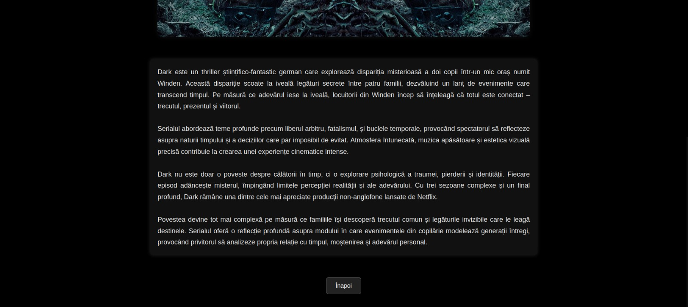
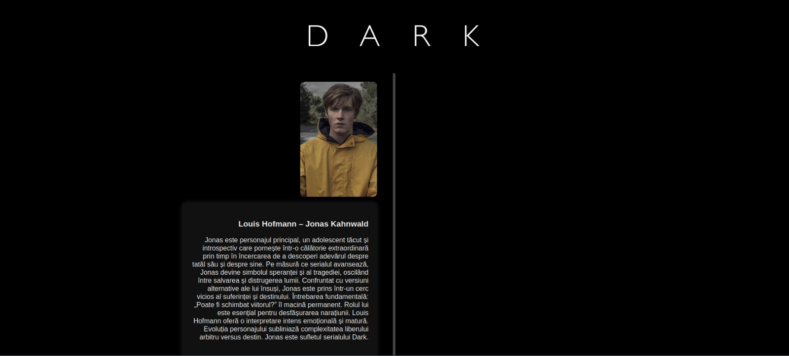
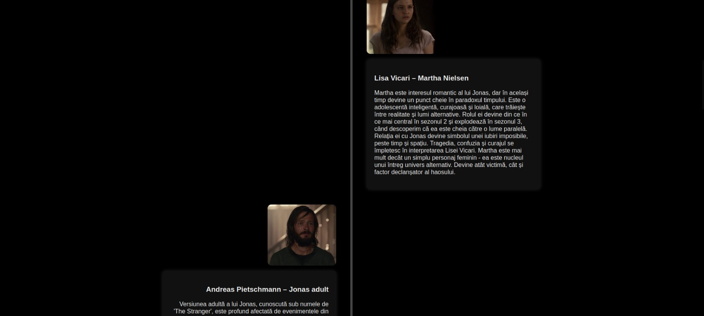
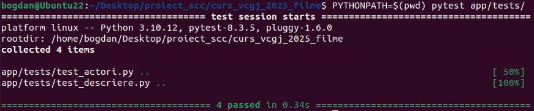
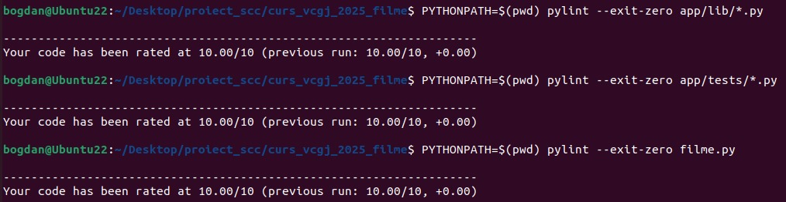

# Mitrea Bogdan-Gabriel


# Cuprins
1. [Descriere aplicație](#descriere-aplicație)
2. [Versiune și funcționalități](#versiune-și-funcționalități)
3. [Tehnologii utilizate](#tehnologii-utilizate)
4. [Structura proiectului](#structura-proiectului)
5. [Configurare și rulare locală](#configurare-și-rulare-locală)
6. [Prezentare interfață web](#prezentare-interfață-web)
7. [Testare cu Pytest](#testare-cu-pytest)
8. [Analiză statică cu Pylint](#analiză-statică-cu-pylint)
9. [Containerizare cu Docker](#containerizare-cu-docker)
10. [Pipeline Jenkins](#pipeline-jenkins)
11. [Pull Request](#pull-request)
12. [Bibliografie](#bibliografie)

---

# Descriere aplicație

Aplicația este o platformă web construită cu Flask, care afișează informații despre serialul ales – „Dark”. Utilizatorul poate accesa o pagină de descriere și o pagină despre actori, fiecare organizată într-un mod vizual modern și interactiv. Aplicația este simplă, dar include toate funcționalitățile cerute: rutare, afișare de informații, containerizare, testare automată și integrare continuă.


# Versiune și funcționalități

Versiunea curentă oferă următoarele funcționalități:
- Pagina principală (homepage) cu un card atractiv despre serialul „Dark”
- Pagină dedicată serialului, cu două rute: „Descriere” și „Actori”
- Pagină de descriere cu text informativ și imagine integrată
- Pagină de actori cu layout grafic modern: carduri individuale pentru fiecare actor
- Navigare intuitivă prin butoane și linkuri
- Interfață responsive (bazată pe CSS)


# Tehnologii utilizate

- **Python + Flask** – framework pentru aplicația web
- **HTML + CSS** – layout și stilizare interfață
- **Pytest** – testare unitară
- **Pylint** – analiză statică a codului
- **Docker** – containerizare și rulare multiplatformă
- **Jenkins + Blue Ocean** – automatizare pipeline CI/CD


# Structura proiectului
Structura proiectului este organizată astfel:

```text
curs_vcgj_2025_filme/
├── app/
│   ├── lib/
│   │   ├── actori.py             # funcție pentru afișarea actorilor
│   │   └── descriere.py          # funcție pentru afișarea descrierii
│   └── tests/
│       ├── test_actori.py        # teste unitare pentru actori
│       └── test_descriere.py     # teste unitare pentru descriere
│
├── static/
│   ├── images/                   # imagini pentru interfața web
│   ├── screenshots/              # capturi de ecran pentru README
│   └── styles/
│       └── style.css             # stilizarea paginilor HTML
│
├── templates/
│   ├── index.html                # homepage
│   ├── dark.html                 # pagină principală pentru serial
│   ├── descriere.html            # pagină cu descrierea serialului
│   └── actori.html               # pagină cu actorii serialului
│
├── Dockerfile                    # fișier de build pentru containerizare
├── Jenkinsfile                   # definirea pipeline-ului Jenkins
├── filme.py                      # aplicația Flask
└── README.md                     # documentația proiectului
```


# Configurare și rulare locală

### 1. Clonare repository

```bash
git clone https://github.com/larisa-mortoiu/curs_vcgj_2025_filme.git
cd curs_vcgj_2025_filme
git checkout dev_Mitrea_Bogdan
```

### 2. Instalare dependențe

```bash
sudo apt update
sudo apt install python3 python3-pip docker.io
pip install flask pytest pylint
```

### 3. Rulare aplicație local

```bash
python3 filme.py
```

Aplicația poate fi accesată la: http://127.0.0.1:5000/


# Prezentare interfață web

### Homepage

Pagina principală conține un card vertical dedicat serialului **Dark**, care direcționează utilizatorul spre pagina dedicată serialului.


### Pagina „Dark”

Această pagină afișează titlul serialului și două carduri verticale:
- **Descriere**
- **Actori**

Cardurile au efecte vizuale la hover și sunt centrate pe ecran.


### Pagina descriere

Conține o imagine banner în partea de sus și un text informativ extins despre serial. Totul este centrat și responsive.



---

### Pagina actori

Actorii principali sunt afișați în carduri verticale, alternând între stânga și dreapta unei linii centrale. Fiecare card include:
- Numele actorului
- Rolul interpretat
- O scurtă descriere
- Imagine reprezentativă






# Testare cu Pytest

Testele unitare se află în directorul `app/tests/` și validează:

- Prezența actorului principal;
- Numărul minim de actori;
- Conținutul descrierii;
- Lungimea minimă a descrierii.

Comandă rulare locală:

```bash
pytest app/tests/
```



# Analiză statică cu Pylint

Analiza codului a fost realizată folosind `pylint` asupra următoarelor fișiere:

```bash
PYTHONPATH=$(pwd) pylint --exit-zero app/lib/*.py
PYTHONPATH=$(pwd) pylint --exit-zero app/tests/*.py
PYTHONPATH=$(pwd) pylint --exit-zero filme.py
```



Scor obținut: `10.00/10`

Toate regulile de stil, structură și documentare au fost respectate.


# Containerizare cu Docker

Containerizarea este un proces prin care aplicația este „împachetată” împreună cu toate dependințele ei (biblioteci, configurări etc.) într-un mediu izolat – numit **container** – astfel încât să poată rula pe orice sistem, indiferent de configurația locală.

Prin folosirea Docker:
- asigurăm portabilitatea aplicației (funcționează identic pe orice mașină)
- evităm problemele de tipul „merge la mine, dar nu la tine”
- putem construi imagini (versiuni exacte ale aplicației) care pot fi partajate ușor
- rulăm aplicația într-un mod controlat, fără a ne baza pe sistemul de operare local

### Structura fișierului `Dockerfile`

Fișierul `Dockerfile` definește pas cu pas **cum se construiește imaginea** Docker. Conținutul complet al `Dockerfile` folosit:

```text
FROM python:3.10-slim

WORKDIR /app

COPY . .

RUN pip install flask pytest

EXPOSE 5000

CMD ["python3", "filme.py"]
```

### Creare imagine container

După ce `Dockerfile` a fost scris și salvat în directorul principal al proiectului, putem construi imaginea rulând comanda:

```bash
docker build -t darkimage:v1 .
```

### Rulare container

După ce imaginea a fost creată, putem porni aplicația într-un container folosind comanda:

```bash
docker run -d --name darkcontainer -p 8020:5000 darkimage:v1
```
Aplicația devine accesibilă la adresa: http://127.0.0.1:8020

Containerele (active și oprite) pot fi vizualizate astfel:

```text
docker ps -a
```

# Pipeline Jenkins

Pentru procesul de Continuous Integration (CI), fișierul `Jenkinsfile` definește un pipeline format din patru etape esențiale pentru asigurarea calității aplicației:

1. **Build** – construiește imaginea Docker pe baza fișierului `Dockerfile`
2. **Pylint** – rulează analiza statică a codului (cu `--exit-zero` pentru a nu opri pipeline-ul)
3. **Pytest** – execută testele unitare definite în `app/tests/`
4. **Deploy** – pornește containerul rezultat la final, pe portul 8020

Acest pipeline este rulat într-un job de tip *Pipeline* și este configurat să ruleze direct din fișierul `Jenkinsfile` al proiectului. 
Lansarea serverului Jenkins local se face prin comanda:

```text
systemctl start jenkins
```

Interfața grafică Blue Ocean oferă o vizualizare clară de ansamblu a fiecărei etape:


# Pull Request

Am realizat un PR din branch-ul de dezvoltare (dev_Mitrea_Bogdan) către branch-ul main (main_Mitrea_Bogdan)


# Bibliografie

- [Flask Documentation](https://flask.palletsprojects.com/)
- [Pytest Documentation](https://docs.pytest.org/)
- [Pylint Documentation](https://pylint.readthedocs.io/)
- [Docker Documentation](https://docs.docker.com/)
- [Jenkins Documentation](https://www.jenkins.io/doc/)
