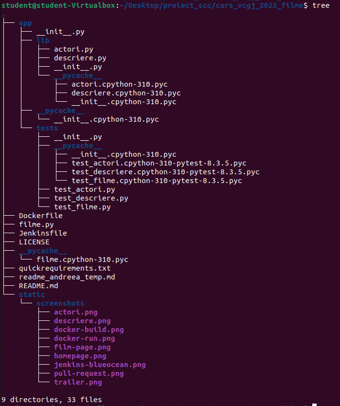
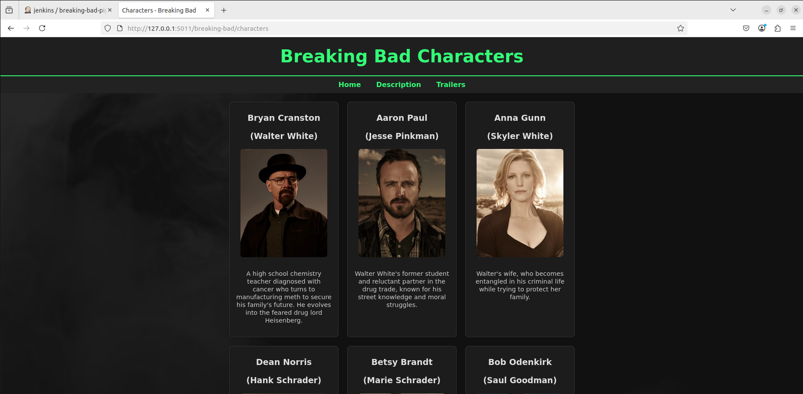
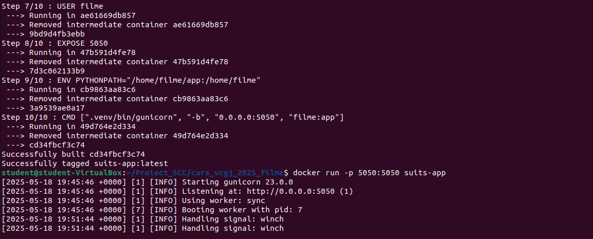
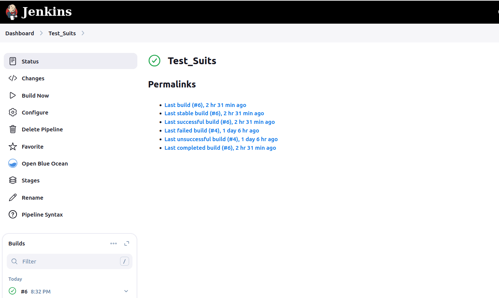

# Cuprins
1. [Prezentarea generala a aplicatiei](#prezentarea-generala-a-aplicatiei)
2. [Versiuni si functionalitati disponibile](#versiuni-si-functionalitati-disponibile)
3. [Tehnologii utilizate](#tehnologii-utilizate)
4. [Structura proiectului](#structura-proiectului)
5. [Instructiuni de instalare si configurare](#instructiuni-de-instalare-si-configurare)
6. [Interfata web prezentare](#interfata-web-prezentare)
7. [Testare cu pytest](#testare-cu-pytest)
8. [Verificare statica cu pylint](#verificare-statica-cu-pylint)
9. [Utilizare Docker si containerizare aplicatie](#utilizare-docker-si-containerizare-aplicatie)
10. [Pipeline Jenkins](#pipeline-jenkins)
11. [Pull Request](#pull-request)
12. [Bibliografie](#bibliografie)

# Prezentarea generala a aplicatiei
Aplicația *MovieHub* este o aplicație web dezvoltată cu Flask, având ca scop afișarea detaliilor despre filmul *The Imitation Game (2014)*. Utilizatorii pot naviga printr-o interfață simplă și intuitivă pentru a vedea o descriere completă, distribuția actorilor (cu poze) și trailerul oficial.

# Versiuni si functionalitati disponibile
Versiunea curentă `v0` include:
- afișarea unui film cu două atribute: descriere și distribuție
- galerie actori cu imagini egale
- trailer video embedded (YouTube)
- navigare între pagini cu linkuri de întoarcere
- testare automată cu Pytest
- analiză statică cu Pylint
- rulare locală și containerizare cu Docker
- pipeline CI/CD cu Jenkins

# Tehnologii utilizate
- **Flask** – framework backend pentru rute și logică aplicație
- **HTML + CSS** – interfață și stilizare web
- **Pytest** – testare unitară
- **Pylint** – analiză statică a codului Python
- **Docker** – rulare în container
- **Jenkins** – CI/CD cu lint, test și build automat

# Structura proiectului
```
curs_vcgj_2025_filme/
├── app/
│   ├── lib/
│   │   ├── actori.py
│   │   ├── descriere.py
│   └── tests/
│       ├── test_actori.py
│       ├── test_descriere.py
│       └── test_filme.py
├── Dockerfile
├── Jenkinsfile
├── LICENSE
├── filme.py
├── quickrequirements.txt
├── README.md
```



# Instructiuni de instalare si configurare
```bash
# clonare repo
cd ~/Desktop
git clone https://github.com/larisa-mortoiu/curs_vcgj_2025_filme.git
cd curs_vcgj_2025_filme
git checkout dev_popa_andreea

# activare mediu virtual
source activeaza_venv.sh

# instalare dependinte
pip install -r quickrequirements.txt

# rulare aplicatie
. ./ruleaza_app.sh
```

Aplicația este accesibilă la: [http://127.0.0.1:5050](http://127.0.0.1:5050)

# Interfata web prezentare
- `/` – Pagina principală cu poster și buton
- `/imitation-game` – Detalii film
- `/imitation-game/descriere` – Descriere detaliată
- `/imitation-game/actori` – Galerie actori cu poze egale
- `/imitation-game/trailer` – Trailer embed din YouTube

## Capturi interfață





# Testare cu pytest
```bash
pytest app/tests/
```
Teste acoperite:
- status 200 pentru fiecare rută
- conținut `descriere` (cu „Turing” / „Enigma”)
- conținut `actori` (cu „Cumberbatch” / „Knightley”)
- import corect funcții din `app/lib`

## Rulare pytest


# Verificare statica cu pylint
```bash
pylint filme.py app/lib/*.py app/tests/*.py --exit-zero
```
Se validează stilul și structurarea codului fără oprirea pipeline-ului (prin `--exit-zero`).


# Utilizare Docker si containerizare aplicatie
```bash
docker build -t filme-app .
docker run -p 5050:5050 filme-app
```
Aplicația devine accesibilă la [http://localhost:5050](http://localhost:5050)




# Pipeline Jenkins
Pipeline-ul definit în `Jenkinsfile` conține etape de:
- build mediu virtual
- rulare `pylint`
- rulare `pytest`
- build Docker image
- run container cu `filme.py`

Execuția este vizibilă în interfața Blue Ocean Jenkins.



# Pull Request
PR creat din branch `dev_popa_andreea` către `main`, aprobat de reviewer și validat prin rularea testelor automate în Jenkins.


# Bibliografie
- [Flask](https://flask.palletsprojects.com)
- [Pytest](https://docs.pytest.org)
- [Docker](https://docs.docker.com)
- [Jenkins](https://www.jenkins.io/doc)
- [Pylint](https://pylint.pycqa.org)
